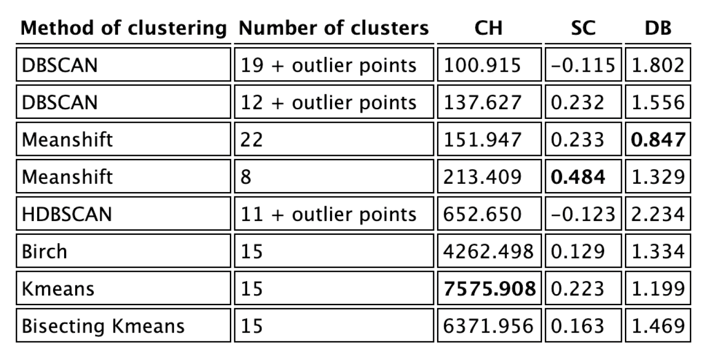

# molecules-clustering
Research Project - Mines Nancy

The objective of this part of the project is the development of clustering algorithms adapted to complex molecular data.

### Molecules Clustering on quantitative data

I used different clustering algorithms to cluster molecules from the ESOL_delaney-processed dataset only with quantitative data and compared the results according to three metrics.

### Molecules Clustering using SMILES representation

I followed the methods and the scripts of two papers to cluster molecules from the compound-annotation dataset and compared the results according to three metrics.

