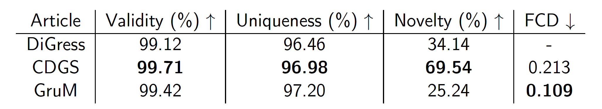
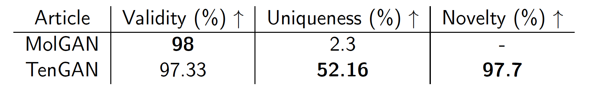

# molecules-generation
Research Project - Mines Nancy

The objective of this part of the project is to do a state of the art of molecules generation methods and to compare different methods.

I focus my research on two methods : GAN and diffsuion process.
To compare the results of the methods, I always used method trained on the same QM9 dataset.

### Methods based on diffusion process

I used the methods and scripts of three articles. I used the scripts given by the author on the GitHub page associated with the paper.

The CDGS and GruM GitHub pages already provides checkpoints for the training of their model on the QM9 dataset. So, I used these checkpoints to generate  my own 10 000 molecules.

For the DiGress method, I trained the model on the QM9 dataset and then generate my own 10 000 molecules. 

### Methods based on GAN

For the methods based on GAN, I only relied on the results given by the author in their paper.

